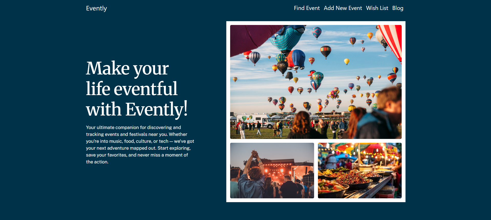
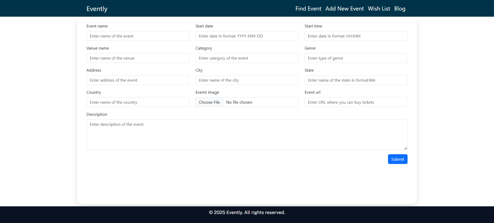
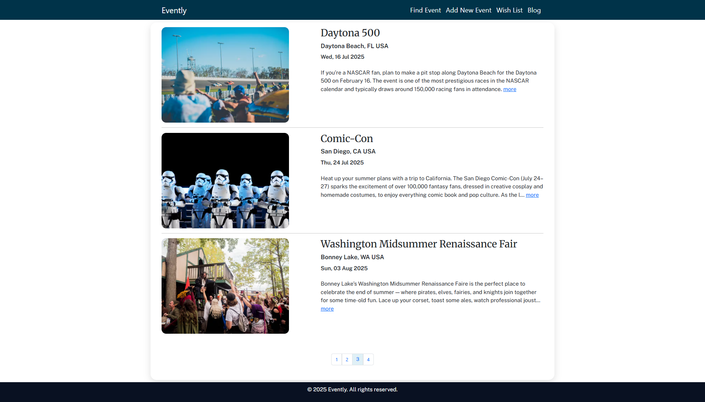
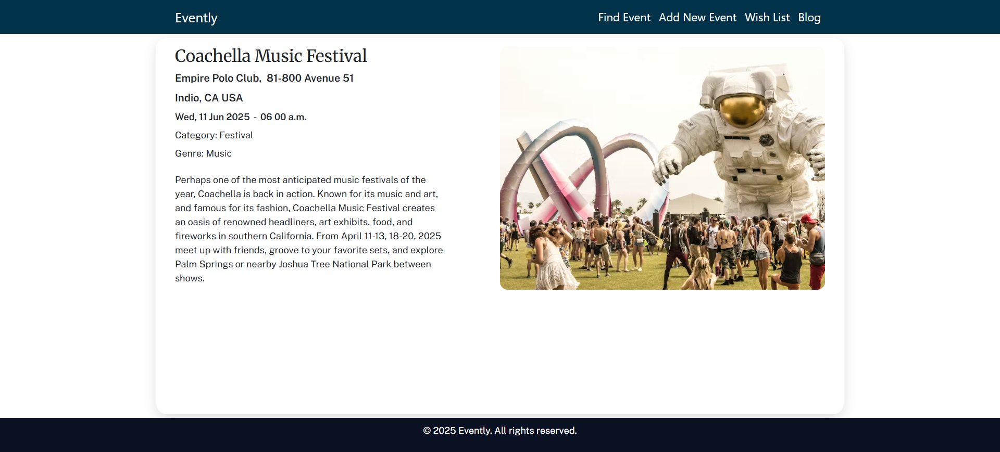
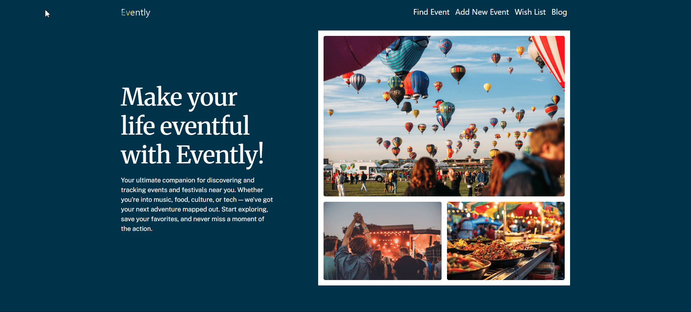

# Python Live Project

## Introduction

**Role**: Full-Stack Developer

Evently is a full-stack web application that helps users discover and manage events of interest. It allows users to search for live events using various filters (such as keyword, date, category, city, state, or country) via the Ticketmaster API, and provides tools to save favorite events to a personalized wish list. Users can also add their own events to a local database, complete with file upload support, and manage those entries through full CRUD operations. Additionally, Evently features embedded maps via Google Maps API, a blog section populated through web scraping with BeautifulSoup, and direct ticket purchase links to external vendors.

This application was developed as part of a two-week apprenticeship sprint for Prosper IT Consulting during my time at The Tech Academy. Although each developer built their own app independently, we followed Agile/Scrum practices such as daily stand-ups, sprint planning, user stories, and retrospectives to simulate a real team environment and ensure structured project management. This experience provided a hands-on opportunity to deliver a fully functional web application within a professional development cycle.

## Core Technologies

-   **Backend**: Python, Django
-   **Frontend**: HTML, CSS, Bootstrap, JavaScript, jQuery
-   **Database**: SQLite (via Django ORM)
-   **APIs**:
    -   [Ticketmaster Discovery API](https://developer.ticketmaster.com/products-and-docs/apis/discovery-api/) (event search)
    -   [Google Maps JavaScript API](https://developers.google.com/maps/documentation/javascript) (location display)
-   **Libraries**: BeautifulSoup (web scraping)
-   **Version Control & Project Management**: Git, Azure DevOps

## Key Features

-   **Event Search**: Users can filter events by keyword, date, category, city, state, or country using live data from the Ticketmaster API.

-   **Wish List**: Users can save events to a personal wish list for easy access and manage them by updating or deleting entries as needed.

-   **Google Maps Integration**: View the location of saved events on an embedded Google Map for easy geographic context.

-   **"Buy Tickets" Feature**: Each event includes a button linking users directly to external vendors to purchase tickets.

-   **Web Scraping Integration**: BeautifulSoup was used to scrape a travel tips article from a third-party website, which is displayed in the app's blog section for direct user access.

## User Stories

1. [Basic App Structure](#basic-app-structure)
2. [Create Model](#create-model)
3. [Display All Items](#display-all-items)
4. [Details View](#details-view)
5. [Edit And Delete Functions](#edit-and-delete-functions)
6. [Connect to API](#connect-to-api)
7. [Parse JSON](#parse-json)
8. [Parse HTML with BeautifulSoup](#parse-html-with-beautifulsoup)
9. [Front-End Improvements](#front-end-improvements)
10. [Save API Results](#save-api-results)

---

### Basic App Structure

The first task was to connect a new app and set up its basic structure, included creating additional folders and files, and configuring Django settings.

I started with updating settings.py and urls.py in the main project folder, created a static and a templates folders for my app, created a urls.py file inside the app and added a url for my home page. Next I wrote a simple function in views.py to render the home page. After that, I created base.html and home.html templates and added some styling. Finally, I connected my app to the main AppBuilder9000 homepage so it could be easily accessed.



---

### Create Model

To complete this user story, I needed to create a Django model to store event data in the database and display it in the app. This step was important because building the model structure properly from the start made development easier in the later stages.

Before creating the model, I decided to explore the API documentation to understand what data is returned in the API responses, since I planned to add a feature that saves events from the API into the database. To make working with the API easier, I used Postman to test the requests and see the response data. Once I selected the necessary fields, I created an Event model using Django’s ORM and ran migrations to generate the database table.

```python
class Event(models.Model):
    event_name = models.CharField(max_length=150)
    event_url = models.CharField(max_length=100, null=True, blank=True)
    evemt_image = models.FileField(upload_to="Evently/events", null=True, blank=True)
    start_date = models.DateField(auto_now=False, auto_now_add=False)
    start_time = models.TimeField(auto_now=False, auto_now_add=False, null=True, blank=True)
    category = models.CharField(max_length=100, null=True, blank=True)
    genre = models.CharField(max_length=100, null=True, blank=True)
    vanue_name = models.CharField(max_length=100, null=True, blank=True)
    address = models.CharField(max_length=150, null=True, blank=True)
    city = models.CharField(max_length=100)
    state = models.CharField(max_length=50, null=True, blank=True)
    country = models.CharField(max_length=100)
    description = models.TextField(max_length=1000, null=True, blank=True)
    latitude = models.FloatField(null=True, blank=True)
    longitude = models.FloatField(null=True, blank=True)
    in_wish_list = models.BooleanField(default=False)
    visited = models.BooleanField(default=False)

    objects = models.Manager()  # The default manager.

    def __str__(self) -> str:
        return self.event_name

    # returns dictionary with event's geolocation.
    @property
    def get_geolocation(self) -> dict[str, float | None]:
        return {"latitude": self.latitude, "longitude": self.longitude}

    class Meta:
        # sorts instances of the class by date and name in querysets
        ordering = ["start_date", "event_name"]

```

Next, I built a form based on the Event model and created an "Add Event" HTML page. This form allows users to submit details such as event name, start date, start time, venue name, category, genre, address, city, state, country, event image, event URL, and description.

```python
class AddEventForm(forms.ModelForm):
    class Meta:
        model = Event
        fields = ['event_name',
                  'start_date',
                  'start_time',
                  'vanue_name',
                  'category',
                  'genre',
                  'address',
                  'city',
                  'state',
                  'country',
                  'evemt_image',
                  'event_url',
                  'description',
                  ]
        widgets = {
            'event_name': forms.TextInput(attrs={"placeholder": "Enter name of the event",'class': 'form-control'}),
            'start_date': forms.DateInput(attrs={"placeholder": "Enter date in format: YYYY-MM-DD",'class': 'form-control'}),
            'start_time': forms.TimeInput(attrs={"placeholder": "Enter date in format: HH:MM",'class': 'form-control'}),
            'category': forms.TextInput(attrs={"placeholder": "Enter category of the event",'class': 'form-control'}),
            'genre': forms.TextInput(attrs={"placeholder": "Enter type of genre",'class': 'form-control'}),
            'vanue_name': forms.TextInput(attrs={"placeholder": "Enter name of the venue",'class': 'form-control'}),
            'address': forms.TextInput(attrs={"placeholder": "Enter address of the event",'class': 'form-control'}),
            'city': forms.TextInput(attrs={"placeholder": "Enter name of the city",'class': 'form-control'}),
            'state': forms.TextInput(attrs={"placeholder": "Enter name of the state in format:WA",'class': 'form-control'}),
            'country': forms.TextInput(attrs={"placeholder": "Enter name of the country",'class': 'form-control'}),
            'evemt_image': forms.FileInput(attrs={'class': 'form-control'}),
            'event_url': forms.TextInput(attrs={"placeholder": "Enter URL where you can buy tickets",'class': 'form-control'}),
            'description': forms.Textarea(attrs={"placeholder": "Enter description of the event",'class': 'form-control'}),
        }
```



Finally, I tested the form to make sure that the submitted data was correctly saved to the database.

---

_Jump To: [Introduction](#introduction), [Basic App Structure](#basic-app-structure), [Display All Items](#display-all-items), [Edit And Delete Functions](#edit-and-delete-functions), [Parse JSON](#parse-json), [Front-End Improvements](#front-end-improvements), [Save API Results](#save-api-results), [Key Learnings](#key-learnings)_

---

### Display All Items

For this user story, I needed to display all saved events from the database. To do this, I created a "wish list" template and wrote a new view that queries the database and passes the results to the template. For each event, data such as an event image, name, city, state, country, start date, and description are displayed.

I also added pagination for the page to load faster by only loading some of the content at a time using lazy loading.

```python
def pagination(request, events, per_page=3):
    paginator = Paginator(events, per_page)
    page_number = request.GET.get("page")
    page_obj = paginator.get_page(page_number)
    return page_obj


def show_wish_list(request):
    events = Event.objects.all()
    page_obj = pagination(request, events)
    context = {"page_obj": page_obj}
    return render(request, "Evently/Evently_wish_list.html", context)
```

```html

<div class="d-flex flex-row justify-content-between mb-3">
    <div class="col-4 ">
        
    </div>
    <div class="col-7 d-flex flex-column justify-content-between">
        <div>
            <h2 class="title-break">{{ event.event_name }}</h2>
            <p class="event-location">{{ event.city }}, {{ event.state }} {{ event.country }}</p>
            <p class="event-start-datetime mb-4">{{ event.start_date | date:"D, d M Y" }}</p>
            {# .hide-description hides elements when screen width is less then 992px #}
            <p class="event-description hide-description">
                {{ event.description | truncatechars:250 }}
                <a href="">more</a>
            </p>
            {# .hide-details hides elements when screen width is more then 992px #}
            <a class="hide-details" href="">more</a>
        </div>
    </div>
</div>

<hr />
 
```



---

### Details View

In this part, my task was to create a detail page that would show information about a specific event selected by the user.
First, I created a new template called Evently_details.html and added a new URL pattern. Then I wrote a views function that finds the event in the database using its unique ID and sends it to the template. In the details template, I displayed detailed information about the selected event, including the event name, image, start date, start time, category, genre, venue name, address, city, state, country, and description.

```python
def show_details(request, pk):
    event = get_object_or_404(Event, id=pk)
    context = {"event": event}
    return render(request, "Evently/Evently_details.html", context)
```

```html
<div class="d-flex flex-row justify-content-between mb-3">
    <div class="event-height col-5 flex-column justify-content-between">
        <div>
            <h2>{{ event.event_name }}</h2>
            <p class="event-location">{{ event.vanue_name }}, &nbsp;{{ event.address }}</p>
            <p class="event-location">{{ event.city }}, {{ event.state }} {{ event.country }}</p>
            <p class="event-start-datetime ">
                {{ event.start_date | date:"D, d M Y" }}&nbsp; - &nbsp;{{ event.start_time | time:"h
                i a" }}
            </p>
            <p class="event-info">Category: {{ event.category }}</p>
            <p class="event-info mb-4">Genre: {{ event.genre }}</p>
            <p class="event-info">{{ event.description }}</p>
        </div>
    </div>
    <div class="col-6 d-flex flex-column justify-content-between">
        
    </div>
</div>
```



---

### Edit And Delete Functions

At this stage, I added functionality to edit and delete events stored in the database. Users can update fields like event name, start date, start time, venue name, category, genre, address, city, state, country, event image, event URL, and description. To make this easier, I created a view function that loads the existing data into the form so users can make changes.

```python
def update_event(request, pk):
    event = get_object_or_404(Event, id=pk)

    if request.method == "POST":
        form = AddEventForm(request.POST, instance=event)
        if form.is_valid():
            form.save()
            return redirect("wish_list")
    else:
        form = AddEventForm(instance=event)

    context = {"form": form}
    return render(request, "Evently/Evently_add_event.html", context)
```

I also added a delete feature that lets users remove events from the list. To avoid accidental deletions, I included a confirmation step before the event is permanently deleted.

```python
def delete_event(request, pk):
    event = get_object_or_404(Event, id=pk)

    if request.method == "POST":
        event.delete()

        return redirect("wish_list")

    context = {"event": event}
    return render(request, "Evently/Evently_delete_confirmation.html", context)
```


---

_Jump To: [Introduction](#introduction), [Basic App Structure](#basic-app-structure), [Display All Items](#display-all-items), [Edit And Delete Functions](#edit-and-delete-functions), [Parse JSON](#parse-json), [Front-End Improvements](#front-end-improvements), [Save API Results](#save-api-results), [Key Learnings](#key-learnings)_

---

### Connect to API

For this user story, I needed to connect to a selected third-party API and get a response in JSON format. I started by creating a new "Find event" template where the API data would be displayed. Then I wrote a view function that sends a GET request to the API’s URL and saves the response. I printed the data in the console to check the structure and confirm the request was working correctly. This step was important because it helped me understand how to handle and display the API data for the next part of the project.

---

### Parse JSON

In this part of the project, I wanted to display a list of current events using data from the API response and add a search feature, so users can look for events using filters like keyword, start date, category, city, state, and country.
I started by creating a search form on the "Find Event" page and added a container to display the events coming from the API response.

```html
 
<p class="mb-2">Find event by...</p>
<form class="row gx-3 gy-2" action="" method="post">
    
    <div class="col-4">
        <label for="inputKeyword" class="form-label">Keyword</label>
        <input
            type="text"
            name="keyword"
            class="form-control"
            id="inputKeyword"
            placeholder="Keyword to search on"
        />
    </div>
    <div class="col-4">
        <label for="inputStartDate" class="form-label">Start date</label>
        <input
            type="date"
            name="start-date"
            class="form-control"
            id="inputStartDate"
            placeholder="Filter with a start date after this date"
        />
    </div>
    <div class="col-4">
        <label for="inputCategory" class="form-label">Category</label>
        <input
            type="text"
            name="category"
            class="form-control"
            id="inputCategory"
            placeholder="Filter by category or genre"
        />
    </div>
    <div class="col-4">
        <label for="inputCity" class="form-label">City</label>
        <input
            type="text"
            name="city"
            class="form-control"
            id="inputCity"
            placeholder="Filter by city"
        />
    </div>
    <div class="col-4">
        <label for="inputState" class="form-label">State</label>
        <input
            type="text"
            name="state"
            class="form-control"
            id="inputState"
            placeholder="Filter by state code"
        />
    </div>
    <div class="col-4">
        <label for="inputCountry" class="form-label">Country</label>
        <input
            type="text"
            name="country"
            class="form-control"
            id="inputCountry"
            placeholder="Filter by country code"
        />
    </div>
    <div class="col-12 text-end mt-3">
        <button type="submit" class="btn btn-primary">Find Event</button>
    </div>
</form>

<div class="error-container">
    <p class="error-message">Unfortunately, nothing was found for your request.</p>
</div>


<div class="api-content">
    
    <div class="d-flex flex-row justify-content-between mb-3">
        <div class="col-3 ">
            
        </div>
        <div class="col-7 d-flex flex-column justify-content-between">
            <div>
                <h2 class="title-break">{{ event.name }}</h2>
                
                <p class="event-location">
                    {{ embedded.venues.0.city.name }}, {{ embedded.venues.0.state.stateCode }} {{
                    embedded.venues.0.country.countryCode }}
                </p>
                
                <p class="event-start-datetime mb-4">{{ event.dates.start.localDate }}</p>
                <a class="btn btn-info" href="#">Add to wish list</a>
            </div>
        </div>
    </div>
    
</div>

```

Then, I improved the view function from the previous step. I added form validation to check if the user entered any search parameter and set today’s date as the default for the start date field if no other date is entered. I handled possible errors too, like HTTP errors or attribute errors in the form.

```python
def find_event(request):
    if request.method == "POST":
        # takes data from the search form to use this data in api url
        #  if the form field is emty get() methos returns empty string('')
        search_parameters = {
            "keyword": request.POST.get("keyword"),
            "startDateTime": (
                # takes today's date if Start date field is emty, else takes the user-entered date
                request.POST.get("start-date")
                if request.POST.get("start-date") != ""
                else str(datetime.date.today())
            ),
            "classificationName": request.POST.get("category"),
            "city": request.POST.get("city"),
            "countryCode": request.POST.get("country"),
            "stateCode": request.POST.get("state"),
        }
        api_search_parameters = ""

        # this block of code checks which fields have been filled and
        # add entered data to the api_search_parameters variable as extra search parameters
        for k, v in search_parameters.items():
            if v != "":
                if k == "startDateTime":
                    v += "T00:00:00Z"
                api_search_parameters += f"{k}={v}&"

        api_url = f"https://app.ticketmaster.com/discovery/v2/events.json?{api_search_parameters}size=50&sort=date,asc&apikey={API_KEY}"
        # sends a GET request to the API URL and saves the response
        response = requests.get(api_url)

        #
        try:
            events = response.json().get("_embedded").get("events")  # extracts data from JSON
            response.raise_for_status()  # Raises HTTPError for bad status codes (4xx or 5xx)

            context = {"events": events}
            return render(request, "Evently/Evently_find_event.html", context)

        except requests.exceptions.HTTPError as e:
            print(f"HTTP error occurred: {e}")
            return render(request, "Evently/Evently_find_event.html", {"error": str(e)})

        except (requests.exceptions.RequestException, AttributeError) as e:
            print(f"Error occurred: {e}")
            return render(request, "Evently/Evently_find_event.html", {"error": str(e)})

    return render(request, "Evently/Evently_find_event.html")
```


<br/>

While working on this task, I ran into an issue when trying to access data from the API response. The problem was that Django's template language doesn’t work well with dictionary keys that start with an underscore — it throws an error. To fix this, I created a "templatetags" module and added a file dict_access.py. inside of it. In that file, I registered a filter that helps circumvent this problem.

---

### Parse HTML with BeautifulSoup

I used the BeautifulSoup library to scrape an article from an external website that shares tips on how to travel on a budget. After installing the library in my virtual environment, I set up a Python script to send an HTTP request to the target website. After that I wrote code to parse the HTML and extract the needed information. I also created a "Blog" page in the app to show this article so users could access the travel tips directly from the application. This task gave me hands-on experience with web scraping and taught me how to extract and present information from external sources within a web application.

```python
def show_blog(request):
    try:
        # sends a GET request to the passed URL and saves the response
        html_page = requests.get("https://www.investopedia.com/how-to-travel-on-a-budget-8655623")
        html_page.raise_for_status()  # Raises HTTPError for bad status codes (4xx or 5xx)

    except requests.exceptions.RequestException as e:
        return render(request, "Evently/Evently_blog.html", {"error": str(e)})

    # Parse the HTML content to extract the article's title and body
    soup = BeautifulSoup(html_page.content, "html.parser")
    title = str(soup.find("h1", id="article-heading_1-0"))
    article = str(soup.find("div", id="article-body_1-0"))
    context = {"title": title, "article": article}

    return render(request, "Evently/Evently_blog.html", context)
```


---

_Jump To: [Introduction](#introduction), [Basic App Structure](#basic-app-structure), [Display All Items](#display-all-items), [Edit And Delete Functions](#edit-and-delete-functions), [Parse JSON](#parse-json), [Front-End Improvements](#front-end-improvements), [Save API Results](#save-api-results), [Key Learnings](#key-learnings)_

---

### Front-End Improvements

At this step, I worked on improving the UX/UI design to make the app more user-friendly and visually appealing. I slightly changed the structure of some HTML files and added a few animations using the jQuery library. I also adjusted font sizes, margins, paddings, and added background styles with CSS to improve overall layout and readability.

```javascript
$(document).ready(function () {
    $(".animate-container").animate({ height: "750px", opacity: 1 }, 1000);

    /*the shineLoop function uses the chaining technique to utilize
    multiple animate event methods in the same function*/
    function shineLoop() {
        $(".shine")
            .animate({ backgroundPositionX: "200px" }, 4000)
            .animate({ backgroundPositionX: "-200px" }, 4000);
    }
    /*setInterval will repeat the shineLoop function and 0 sets the 
    delayed amount of time between each repeat*/
    setInterval(shineLoop, 0);
});
```



<br/>

To enhance user experience, I implemented a "scroll to top" button on the "Find Event" page using JavaScript. Additionally, I used Bootstrap to create a responsive hamburger menu that appears when the screen width is less than 992px.

```javascript
const scrollToTopBtn = document.querySelector("#scroll-btn");

// shows the button when the user scrolls down 300px from the top of the document.
window.onscroll = function () {
    scrollFunction();
};

function scrollFunction() {
    if (document.body.scrollTop > 300 || document.documentElement.scrollTop > 300) {
        scrollToTopBtn.style.display = "block";
    } else {
        scrollToTopBtn.style.display = "none";
    }
}

// scrolls to the top of the document when the user clicks on the button.
function scrollToTop() {
    document.body.scrollTop = 0; // For Safari
    document.documentElement.scrollTop = 0; // For Chrome, Firefox, IE and Opera
}
```


---

### Save API Results

In the final user story, I needed to add functionality that lets users save their favorite events—found through the API—to the wish list. I wrote a function that takes an event ID (which comes from the API response) and sends another API request using that ID. The function then extracts all the needed event details from the response and passes them into a form to be saved in the database. After saving, the user is redirected to the "Wish List" page where they can see their newly saved event along with other favorites.

Since the API response includes latitude and longitude data, I decided to integrate Google Maps into the "Details" page with a marker showing the event's location. I also added a button that links to external ticket vendors website to make the app more useful and convenient.

```python
def add_to_wish_list(request, event_id):
    api_url = f"https://app.ticketmaster.com/discovery/v2/events/{event_id}.json?apikey={API_KEY}"

    try:
        response = requests.get(api_url)
        response.raise_for_status()
        data = response.json()
    except requests.RequestException as e:
        return render(request, "Evently/Evently_find_event.html", {"error": str(e)})

    new_event = Event()
    new_event.event_name = data.get("name")
    new_event.event_url = data.get("url")
    new_event.evemt_image = data["images"][0].get("url")
    new_event.start_date = data["dates"]["start"].get("localDate")
    # .get() will return None if there's no such key as "localTime"
    new_event.start_time = data["dates"]["start"].get("localTime")
    new_event.category = data["classifications"][0]["segment"].get("name")
    new_event.genre = data["classifications"][0]["genre"].get("name")
    new_event.vanue_name = data["_embedded"]["venues"][0].get("name")
    new_event.address = data["_embedded"]["venues"][0]["address"].get("line1")
    new_event.city = data["_embedded"]["venues"][0]["city"].get("name")
    new_event.state = data["_embedded"]["venues"][0]["state"].get("stateCode")
    new_event.country = data["_embedded"]["venues"][0]["country"].get("countryCode")
    # .get() will return "information is not available" if there's no such key as "info"
    new_event.description = data.get("info", "information is not available")
    new_event.latitude = data["_embedded"]["venues"][0]["location"].get("latitude")
    new_event.longitude = data["_embedded"]["venues"][0]["location"].get("longitude")
    new_event.save()

    return redirect("wish_list")
```


---

## Conclusion

Evently is a full-featured event discovery platform that integrates real-time data, user interactivity, web scraping, and external APIs. Through this project, I gained valuable hands-on experience in web development and learned how to work effectively in a team under the guidance of a Scrum Master. I also improved my skills in planning, building, and debugging an application under a time-constrained development cycle. Although I faced several challenges along the way, I was able to learn quickly and adapt, applying new knowledge to meet the project goals successfully.

## Key Learnings

-   **Scrum Methodology:** I learned how to work efficiently in a team using Scrum, participating in sprints, daily stand-ups, and retrospectives to plan, track, and improve our development process.
-   **Planning Before Starting Development:** I realized the importance of planning ahead — reviewing user stories, designing features, and understanding project requirements before jumping into the code helped me work more efficiently and make fewer mistakes.
-   **Full-Stack Web Development:** I gained hands-on experience building both the frontend and backend of a web application using Django, HTML, CSS, and JavaScript, and learned how to connect the two layers to create a functional and responsive product.
-   **API Integration:** I learned how to work with external APIs, send GET requests dynamically adding additional parameters, handle JSON responses, and use the data to display dynamic content and improve the functionality of the app.
-   **Web Scraping:** I used BeautifulSoup to scrape useful information from external website, extract the needed data, and integrate it into my app to enhance its content and user experience.
-   **Debugging & Problem Solving:** Throughout the project, I developed ability to troubleshoot errors, read error messages carefully, and find creative solutions when things didn’t work as expected.
-   **Version Control & DevOps Tools:** I became more confident using Git to track changes and manage code collaboratively. I also gained hands-on experience with Azure DevOps for organizing tasks, managing sprints, and collaborating with teammates in a structured development workflow.
-   **Research & Self-Learning:** When I faced unfamiliar tasks or bugs, I actively researched documentation and online resources to find solutions, improving my ability to learn independently and quickly.

---

_Jump To: [Introduction](#introduction), [Basic App Structure](#basic-app-structure), [Display All Items](#display-all-items), [Edit And Delete Functions](#edit-and-delete-functions), [Parse JSON](#parse-json), [Front-End Improvements](#front-end-improvements), [Save API Results](#save-api-results), [Key Learnings](#key-learnings)_

---
